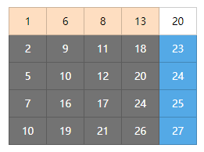

# 问题描述 #

在一个二维数组中，每一行都按照从左到右递增的顺序排序，每一列都按照从上到下递增的顺序排序。
请完成一个函数，输入这样的一个二维数组和一个整数，判断数组中是否含有该整数。

<!--more-->

# 解题思路 #

## 暴力破解 ##

暴力破解方式也就是对二维数组中的每个元素逐个检查，结束条件为找到和目标值相等的元素或者查询到最后一个元素。

对于一个行列数都为n的二维数组而言，最坏的情况是将整个数组遍历完，这种情况下时间复杂度为O(n^2)，并不是一个好的解决方法。

## 优化解法 ##

假设，有一个5*5的二维数组，待查找元素为18，数组如下图所示：



### 查找步骤 ###

视整个数组为待查找区域，对于数组右上角（即行1列5）的元素20，我们可以有以下结论：

- 20所在行左侧数据（图示中黄色部分）均小于20
- 20所在列下方数据（图示中蓝色部分）均大于20
- 20所在位置的左下角部分（图示中灰色部分）数据和20大小关系未知。

因此对于任意待查找元素，可以知道：

1. 如果待查找元素和当前元素（即20）相等，则数组中包含待查找元素，查找结束。
2. 如果待查找元素小于当前元素（即20），则下一步中待查找区域变为图中黄色部分加灰色部分。
3. 如果待查找元素大于当前元素（即20），则下一步中待查找区域变为图中蓝色部分加灰色部分。 

详细步骤为：

- 第一步：从待查找区域中取出右上角（即行1列5）元素20。18小于20，待查找区域变为图中黄色加灰色区域，即1<=行号<=5且1<=列号<=4的区域。
- 第二步：从待查找区域中取出右上角（即行1列4）元素13。13小于18，待查找区域变为图中灰色区域，即2<=行号<=5、1<=列号<=4的区域。
- 第三步：从待查找区域中取出右上角（即行2列4）元素18,18等于18，查找结束。

### 总结 ###

总体思路为：每次取待查找区域右上角元素，然后将待查找区域分为两部分，即新的待查找区域和大于（或小于）当前元素区域。然后一直重复上述操作，直到找到待查找元素或左下角元素。

同样，也可以每次选取待查找区域左下角的元素，然后根据相应规则确定新的待查找区域，此处就不再详细说明。

# 代码 #

每次从待查找区域中选取右上角元素写法：

```java
public boolean find(int target, int[][] array) {
	if(array == null || array.length == 0) {
		return false;
	}
	int rowLength = array.length;
	int colLength = array[0].length;
	
	boolean find = false;
	for(int col=colLength-1, row=0; col>=0 && row<rowLength;) {
		int num = array[row][col];
		if(num == target) {
			find = true;
			break;
		}else if (num<target) {
			row++;
		} else {
			col--;
		}
	}
	return find;
}
```
每次从待查找区域中选取左下角元素写法：

```java
public boolean find(int target, int[][] array) {
	if(array == null || array.length == 0) {
		return false;
	}
	int rowLength = array.length;
	int colLength = array[0].length;
	
	boolean find = false;
	for(int col=0, row=rowLength-1; col<colLength && row>=0;) {
		int num = array[row][col];
		if(num == target) {
			find = true;
			break;
		} else if (num < target) {
			col++;
		} else {
			row--;
		}
	}
	return find;
}
```

代码地址：
https://github.com/zhangyihao/Algorithms/blob/master/com.zhangyihao.algorithms/src/com/zhangyihao/algorithms/offer/Question3.java