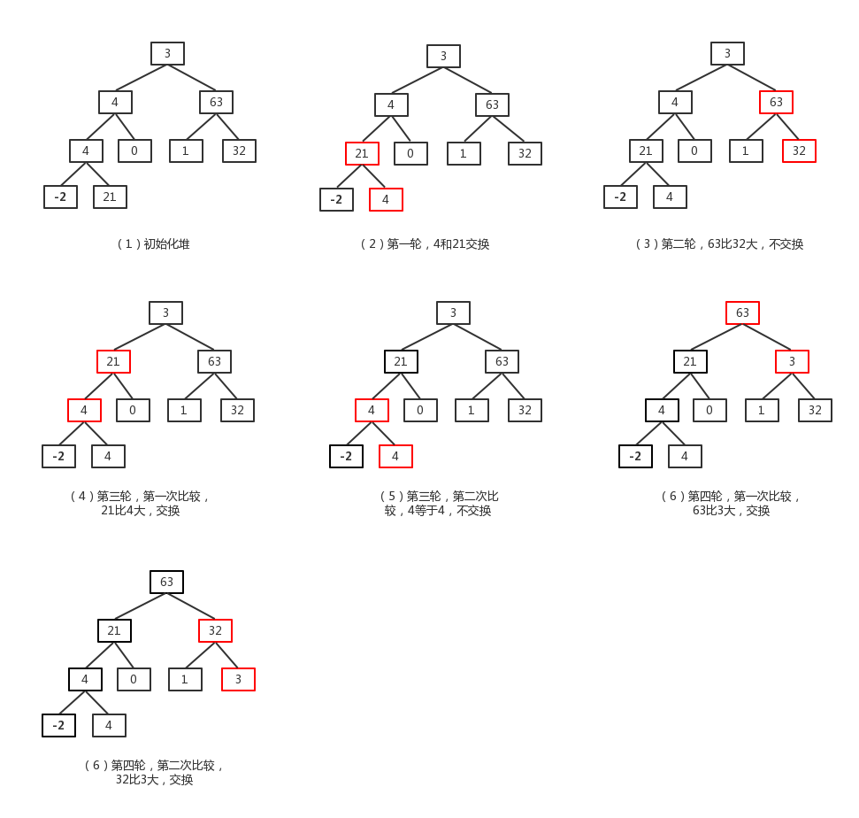
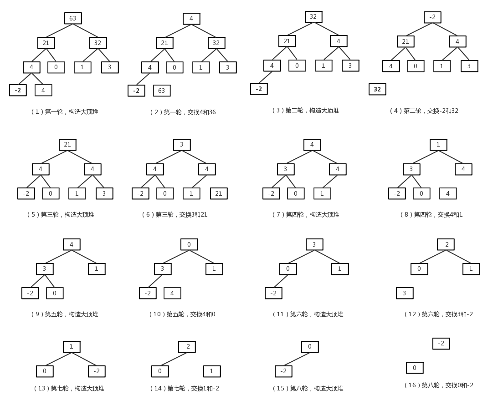

# 基础概念 #

## 完全二叉树 ##

完全二叉树(Complete Binary Tree)：若设二叉树的深度为h，除第 h 层外，其它各层 (1～h-1) 的结点数都达到最大个数，第 h 层所有的结点都连续集中在最左边，这就是完全二叉树。

## 堆 ##

堆总是满足以下两个特性：

- 堆是一棵完全二叉树。
- 堆中每个结点的值总是不大于（或不小于）其子结点的值。

<!--more-->

其中，每个结点的值总是不大于其子结点的值，这种堆成为**小根堆**。
每个结点的值总是不小于其子结点的值，这种堆称为**大根堆**。

因此，对于一个大根堆R来说，元素R[i]（i为元素位置，从0开始）有：

- 它的左孩子结点为：R[2\*i+1]。
- 它的右孩子结点为：R[2\*i+2]。
- 它的父结点为：R[(i-1)/2]。
- R[i]>=R[2\*i+1] 且 R[i]>=R[2\*i+2]

# 排序思想 #

根据堆的性质可知：根结点是最大（或最小）的结点。
因此，对于一个待排序数组可以对数组构造出一个大顶堆，然后将去除最大值的数组再次构造大顶堆，直到待排序序列剩下一个元素为止，每次拿出的数即构成了一个有序序列。

根据上述，排序过程可总结为如下两个操作：

1. 将数组构造成一个大顶堆。
2. 交换第一个（堆的根节点）和最后一个元素（堆上最后一层最右的叶子结点）即把大的元素放到数组最后。然后在将去除最后一个元素的数组重新构造大顶堆。

重复上面两个操作，直到堆中只剩下一个结点。

# 构造大顶堆 #

## 构造步骤 ##

在一个完全二叉树上，对于任意结点R[i]，对以R[i]为根结点的树（假设以R[i]的子结点为根节点的树即R[i]的左子树和右子树已经是大顶堆）进行以下操作：

1. 取R[i]的子结点中较大的结点R[2\*i+1]（此处假设左结点大于右结点）。
2. 若R[2\*i+1]不大于R[i]，则结束。否则，交换R[i]和R[2\*i+1]，交换完成后，以R[2\*i+1]为根结点，重复上述步骤。

结束后，以R[i]为根结点的树即为一个大顶堆。

## 构造示例 ##

对数组[3, 4, 63, 4, 0, 1, 32, -2, 21]构造大顶堆过程如下图所示：


> 构造大顶堆一般先从树上最后一个非叶子节点开始（上图中深度为3、值为4的节点），然后逐渐遍历树上非叶子节点，直到根节点。也就是说对一个元素个数为 n 的（数组长度为n)的树而言，非叶子节点遍历顺序为： (n-2)/2, ((n-2)/2)-1、((n-2)/2)-2、... 、2、1、0。

# 堆排序过程 #

详细过程如下图所示：


# 详细代码 #

根据前面对堆排序的介绍，有如下代码。


```java
public int[] sort(int[] array) {
	int length = array.length;
	while (length > 1) {
		initHeap(array, length);

		System.out.println("初始化堆结果：" + Arrays.toString(array));

		int temp = array[length - 1];
		array[length - 1] = array[0];
		array[0] = temp;

		System.out.println("排序结果：" + Arrays.toString(array));
		length--;
	}
	return array;
}

private void initHeap(int[] array, int length) {
	// 从最后一个非叶子结点的父结点开始
	for (int i = (length - 2) / 2; i >= 0; i--) {
		int parent = i;
		int parentValue = array[parent]; // 记录下parent的值
		int maxChild = 2 * parent + 1; // 先选取左结点为大结点

		while (maxChild < length) {
			// 如果有右结点且右结点大于左结点，选取右结点为大结点
			if ((maxChild + 1) < length && array[maxChild] < array[maxChild + 1]) {
				maxChild++;
			}

			// 如果大结点小于父结点直接结束
			if (array[maxChild] <= parentValue) {
				break;
			}

			// 将大结点的值赋值给父结点
			array[parent] = array[maxChild];
			// 发生交换后，继续调整已大结点为根结点的树
			parent = maxChild;
			maxChild = 2 * parent + 1;
		}

		array[parent] = parentValue;
	}
}
```

在堆排序过程中每轮交换根结点和最后一个结点后的二叉树上，以根结点的子结点为根结点的子树就是一个大顶堆（在堆排序示意图中，第一轮交换后，以根节点4的两个子节点21、32为根节点的子树依然是大顶堆）。

在上边代码中，每轮构造大顶堆时，都是以树上最后一个非叶子结点开始遍历，而树上除根结点外的非叶子结点所构成的树已经是大顶堆，这就造成了没有必要的遍历，增加了循环的次数。

我们可以调整代码逻辑为：首先通过遍历所有的非叶子结点去构造一个大顶堆，然后在以后调整大顶堆过程中都是从根节点开始。

# 优化后代码 #

```java
private static void adjustHeat(int[] array, int parent, int length) {
	// parentValue保存当前父节点
	int parentValue = array[parent];
	// 先选取左结点为大结点
	int maxChild = 2 * parent + 1;

	while (maxChild < length) {
		// 如果有右结点且右结点大于左结点，选取右结点为大结点
		if ((maxChild + 1) < length && array[maxChild] < array[maxChild + 1]) {
			maxChild++;
		}

		// 如果大结点小于父结点直接结束
		if (array[maxChild] <= parentValue) {
			break;
		}

		// 将大结点的值赋值给父结点
		array[parent] = array[maxChild];
		// 发生交换后，继续调整以大结点为根结点的树
		parent = maxChild;
		maxChild = 2 * parent + 1;
	}
	array[parent] = parentValue;
}

public void sort(int[] array) {
	// 循环建立初始堆
	for (int i = (array.length - 2) / 2; i >= 0; i--) {
		adjustHeat(array, i, array.length);
	}

	// 进行n-1次循环，完成排序
	for (int length = array.length - 1; length > 0; length--) {
		// 最后一个元素和第一元素进行交换
		int temp = array[length];
		array[length] = array[0];
		array[0] = temp;

		System.out.println(String.format("第 %d 趟排序结果：", array.length - length) + Arrays.toString(array));

		// 将剩下数组总元素组成的堆继续调整
		adjustHeat(array, 0, length);
	}
}
```

优化前代码地址：
https://github.com/zhangyihao/Algorithms/blob/master/com.zhangyihao.algorithms/src/com/zhangyihao/algorithms/sort/HeapSort.java

优化后代码地址：
https://github.com/zhangyihao/Algorithms/blob/master/com.zhangyihao.algorithms/src/com/zhangyihao/algorithms/sort/HeapSort2.java